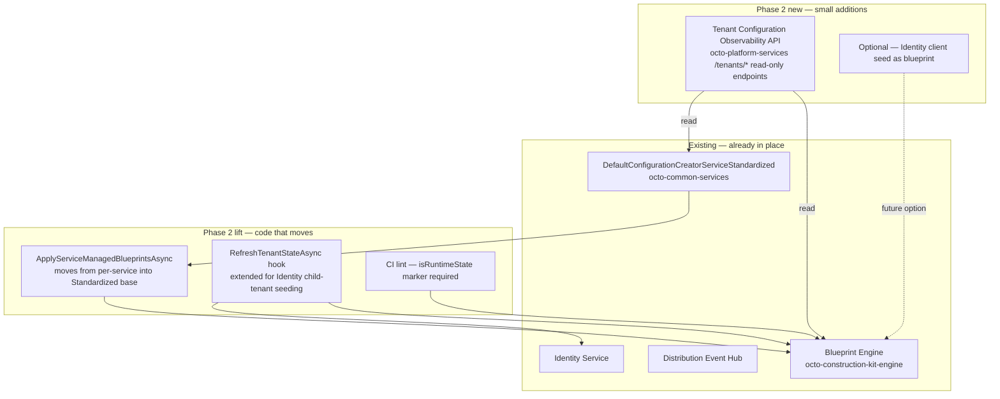

# Phase 2 — CK / Blueprint / Initial-Data Consolidation

**Status:** Draft, 2026-06-12 — discussion basis, nothing implemented yet.
**Author:** Gerald Lochner + Claude (concept skeleton).
**Scope:** OctoMesh core + pro services that own a `DefaultConfigurationCreatorService`. Excludes the AI Adapter Phase-1 work and the existing Communication-Controller / Admin-Panel blueprints (they are inputs, not consumers).

## 1. Why Phase 2

Phase 1 of the octo-platform-services initiative extracted the `_configuration` discovery endpoint. The harder problem — and the original motivation Gerald flagged on 2026-06-12 — is the way every backend service today re-implements its own tenant bootstrap: CK model import, identity-data seeding, runtime entity seeding, version tracking, retry loops. The pain is real; the architecture is not as broken as the early Phase-1 research made it sound. The job for Phase 2 is to **finish what `DefaultConfigurationCreatorServiceStandardized` and the blueprint engine started**, not to invent a parallel registry.

### What turned out to be already solid

The October 2025 work to introduce `DefaultConfigurationCreatorServiceStandardized` and the embedded-blueprint pattern in Communication-Controller + Admin-Panel solved more than the early audit credited:

- **Standardized base** (`octo-common-services/src/Infrastructure/Services/DefaultConfigurationCreatorServiceStandardized.cs`) owns the Enable/Setup/Start/Stop lifecycle, schema-version capture, deferred-tenant batching with the 8-worker pool, the `FailedTenantRegistry` retry loop, and the audit hooks. Seven of the eight services inherit it; the average concrete subclass is under 250 LOC.
- **Embedded blueprints** (`octo-construction-kit-engine`) ship CK-model dependencies, seed data, `requires:` gating, `${octo.*}` variable substitution, dependency topo-sort, `isRuntimeState`-aware Upsert merging, and an append-only `TenantBlueprintInfo` history table. The `ApplyServiceManagedBlueprintsAsync` loop in Communication-Controller and Admin-Panel is **identical** code that has simply not been moved up into the base yet.
- **Distribution Hub** is the existing cross-service wire for identity-data write commands. Six of the eight services already use it via `CreateIdentityDataCommandRequest`.

In other words, the consolidation target already exists in pieces. Phase 2 is about **lifting the proven pattern up one floor** and **fixing the three specific failure modes** that the existing pattern does not yet cover.

## 2. The three concrete pain points

These are the failure modes I want Phase 2 to remove, ranked by incident likelihood. They drive the architecture more than any aesthetic "let's deduplicate" goal.

### P1 — Identity child-tenant drift on attach / restore

Identity is the only service still on `DefaultConfigurationCreatorServiceBase` (not Standardized). Its `SetupTenantAsync` writes 14 roles, 5 identity resources, 3 API scopes, 3 API resources, and 3 OIDC clients **directly into every child tenant's repository** via `EnsureIdentityDataInChildTenantAsync` — bypassing the Distribution Hub. This is intentional (Identity owns its own DI graph), but it means a child tenant that is **attached** or **restored from a different cluster** keeps the seed it had when it was created. Older child tenants that pre-date the Phase-1 client mirror backfill still need a startup-time correction pass.

Symptom in production: a refinery-studio client breaks because an API scope renamed in version 16 → 17 of the Identity schema is missing on a child restored from a backup older than that bump. We have already paid this in [[octo_ai_test2_token_refresh_disabled]] when test-2 needed re-registration.

### P2 — Communication runtime-state preservation depends on CK markers

The Communication-Controller blueprint preserves `Adapter` and `Pool` runtime-state attributes by reading `isRuntimeState: true` flags off the CK model. If a developer adds a new attribute and forgets the marker, the next blueprint version bump silently rewrites it across every tenant on the next service start. Epic 3054 (`recover-mesh-adapter-state.md` runbook) is the documented case.

The fix is two-sided: enforce the marker via CI lint, and make the import audit visible at the cluster level so a wrong bump is caught **before** the rolling deploy clears state across all tenants.

### P3 — Drift is invisible until somebody asks

There is no single place to ask "what CK model version is installed on tenant X, when did blueprint Y last apply, and which tenants are behind by how many versions?" The data exists (`BlueprintInstallation`, `TenantBlueprintInfo`, the per-service schema version key in tenant config), but it is scattered per-service and per-tenant. The Communication-Controller's `RefreshTenantModeAsync` pattern exists precisely because we cannot trust that state is current; that distrust is what we need to make addressable.

The early audit also flagged MACO's non-standard scopes and Report's not-auto-enabled state as additional risks. Both are real, neither is a Phase-2 blocker — they survive Phase 2 unchanged; we just need to make sure the central observability surface tolerates them.

## 3. Goal

After Phase 2:

1. Identity's seed survives `attach` / `restore` / `cross-cluster move` idempotently — same model as Communication-Controller's `RefreshTenantModeAsync`.
2. Every service's CK + identity-data + runtime seed is expressed as **embedded blueprints**, and the apply loop lives on the base — no service-specific `ApplyServiceManagedBlueprintsAsync` duplication.
3. `octo-platform-services` exposes a read API + dashboard for "what is installed on which tenant, when, with which result." Drift is visible without grepping logs.
4. CI catches a missing `isRuntimeState` marker before it ships.
5. No new central service. No new write-path. No new control-plane database.

Non-goals: replacing the Distribution Hub, rewriting the blueprint engine, changing the YAML format, introducing a workflow engine. The goal is the **minimum lift to remove P1–P3**, not a green-field redesign.

## 4. Design

Five components, mostly inside existing repos. Only the observability surface is new code in `octo-platform-services`.



### 4.1 Lift `ApplyServiceManagedBlueprintsAsync` into the base

The Communication-Controller and Admin-Panel implementations of this method are byte-identical apart from the prefix filter (`System.Communication.` vs `System.`). The base class already has a `ImportCkModelAsync()` virtual hook called inside the Enable transaction; a sibling `ApplyServiceManagedBlueprintsAsync(string prefix)` method on the base, called by both Enable and `StartTenantAsync`, lets every Standardized subclass opt in by overriding a property:

```csharp
protected virtual string? ServiceManagedBlueprintPrefix => null;  // opt-in
```

When set, the base discovers `IBlueprintEmbeddedSource` instances whose `BlueprintId.Name` starts with the prefix, groups by name, selects the highest version per group, and applies. The existing per-service implementations get deleted; their `Program.cs` `Add…V1()` blueprint registrations stay.

This removes ~150 LOC across Communication-Controller and Admin-Panel, and unlocks every other Standardized service to switch on blueprints just by setting the property. No code change beyond a one-line override is required to start consuming the pattern.

**Narrowing risk:** Admin-Panel currently uses the broad `System.` prefix, which would match any future `System.Foo` blueprint shipped by another service. Phase 2 narrows it to `System.UI.` plus an explicit allowlist for `System.TenantMode`. Communication-Controller's `System.Communication.` is already narrow.

### 4.2 `RefreshTenantStateAsync` hook for attach / restore

Admin-Panel's existing `RefreshTenantModeAsync` (called from `StartTenantAsync` when `DeferTenantStart=false`) is the proven pattern for "this code path is hit on attach / restore / create, but not on cold-start of the whole service." Generalize it on the base:

```csharp
protected virtual Task RefreshTenantStateAsync(string tenantId) => Task.CompletedTask;
```

`StartTenantAsync` in the base already knows whether it is in the deferred-start path or the per-tenant lifecycle event path (the same flag Admin-Panel uses). It calls `RefreshTenantStateAsync` on the non-deferred branch.

Identity overrides this to **re-run its child-tenant identity-data write-through** for the affected tenant — re-applying roles, identity resources, API scopes, API resources, and clients via the same write-through path it uses on first setup. The current `Standardized` Enable transaction is too coarse for this (it would touch the parent tenant too); the refresh hook scopes it correctly.

This is the minimum fix for P1. Long-term we may want Identity's data seeded **as a blueprint** so the refresh is just `ApplyBlueprintAsync(force:true)`. That is sketched as `IDBP` in the diagram above and listed under §6 as a follow-up.

### 4.3 `isRuntimeState` CI lint

A small validator integrated into the existing `BlueprintEmbed` MSBuild task: every attribute in a CK model that is referenced by a service-managed blueprint must declare `isRuntimeState` (either `true` or `false`, never absent). The task already validates `blueprintId` against the folder name; this is one more rule.

Failure mode is build-time, not runtime — the CK model project fails to compile if a new attribute is added without the marker. This addresses P2 at the only point in the pipeline where the decision is still cheap to make.

### 4.4 Tenant Configuration Observability API in `octo-platform-services`

The first net-new code in this phase. Read-only HTTP endpoints under `/tenants/`:

| Method | Path | Returns |
|---|---|---|
| GET | `/tenants` | list of tenants with summary state |
| GET | `/tenants/{tenantId}/blueprints` | installed blueprints, version, last-applied-at, last-result |
| GET | `/tenants/{tenantId}/ck-models` | installed CK models with version |
| GET | `/blueprints/{blueprintName}/coverage` | per-tenant version, optionally filtered by drift threshold |
| GET | `/services/{serviceKey}/drift` | tenants whose installed schema version is behind the service's expected version |

Data sources, read-only:
- `BlueprintInstallation` collection (per-tenant) for blueprint state
- `TenantBlueprintInfo` history collection for audit
- Per-service tenant configuration row for schema version (the existing `IdentitySchemaVersionValue = 17` style key)

No new write path. No new database. No SignalR. The dashboard is whatever consumes this — a refinery-studio page is the obvious target but out of scope for this concept.

The point of this API is to make P3 addressable: when an operator asks "are all tenants on the latest Communication blueprint", the answer is a single HTTP call instead of a per-tenant inspection.

### 4.5 What stays unchanged

- The Distribution Hub. Six services already use it for identity-data write commands; Identity's write-through remains the documented exception.
- Every service's `Program.cs` blueprint registration. Existing `Add…V1()` extensions stay; only the per-service apply loop gets deleted.
- All YAML formats. No blueprint manifest changes.
- The schema-version key per service. Phase 2 reads it; nothing rewrites it.
- MACO and Report. Custom-scope and not-auto-enabled patterns survive; the observability API tolerates them as outliers.

## 5. Migration plan

Six PRs across two repos. No big-bang. Each PR is independently revertable.

| Step | Repo | What | Risk |
|---|---|---|---|
| 1 | octo-common-services | Add `ServiceManagedBlueprintPrefix` + base `ApplyServiceManagedBlueprintsAsync` | low — additive |
| 2 | octo-communication-controller-services + octo-frontend-admin-panel | Delete service-specific apply loops, set the prefix property, narrow Admin-Panel prefix to `System.UI.` + `System.TenantMode` | low — behavior-preserving, dotnet build + integration tests catch regressions |
| 3 | octo-common-services | Add `RefreshTenantStateAsync` virtual hook, wire into `StartTenantAsync` non-deferred branch | low — additive |
| 4 | octo-identity-services | Override `RefreshTenantStateAsync` to re-run child-tenant identity-data write-through; smoke test on test-2 by attaching a tenant from staging-1 | **medium** — Identity is the high-blast-radius service, run side-by-side against the existing path first |
| 5 | octo-construction-kit-engine | MSBuild `isRuntimeState` lint in `BlueprintEmbed` task | low — opt-in via `<EnforceRuntimeStateMarkers>true</EnforceRuntimeStateMarkers>` until every CK project passes, then on by default |
| 6 | octo-platform-services | Tenant Configuration Observability API under `/tenants/*`, `/blueprints/*`, `/services/*/drift` | low — read-only |

Order is loose; step 4 should land after step 6 so the observability surface can verify the refresh actually fires. The whole plan fits a single iteration if there are no Identity surprises.

## 6. Follow-ups out of scope for Phase 2

- **Identity client seed as a blueprint (Phase 3).** Long-term, expressing Identity's roles + clients + scopes + resources as a `System.Identity.Bootstrap-1.0.0` blueprint would make the refresh path symmetrical with every other service. The Phase 2 / Step 4 implementation chose option (b) (claims-backfill on `EnsureIdentityResourceAsync`) as a targeted fix for the refinery-studio symptom; option (c) — full blueprint extraction — is the architecturally clean follow-up, deferred because it touches IdentityServer's DI graph and the `EnsureIdentityDataInChildTenantAsync` write-through. Once Phase 3 lands, the Step 4 backfill in `EnsureIdentityResourceAsync` can collapse into a normal blueprint upsert.
- **MACO standardization.** MACO's custom scope names (`SystemApi` / `TenantApi` instead of `OctoApiFullAccess`) are a fork in the OAuth pattern. Either rename or formalize — out of scope here.
- **Workflow / approval gates** on blueprint apply (e.g. "production tenants require approval before a `Release` blueprint version bump is applied"). Real ask, real complexity, deferred.
- **Cross-cluster blueprint promotion** (staging → prod). The observability API makes this visible; the workflow is a separate concept.
- **Refinery-Studio dashboard** consuming the observability API. UI work, separate concept.

## 7. Risks

- **Identity refresh is high-blast-radius.** If `RefreshTenantStateAsync` writes to the wrong tenant or runs on every cold-start by accident, every child tenant gets re-seeded on every restart. Mitigation: feature-flag the hook behind a new `IdentityServerOptions.RefreshOnLifecycleEvents` boolean, default off until test-2 burn-in is complete, then on by default.
- **The base-class lift can leak.** The current Communication-Controller and Admin-Panel implementations have subtle differences (Communication-Controller does NOT call refresh from the same branch; Admin-Panel's refresh is `force: true` while Communication is not). Step 2 must keep those differences intact via per-service override of `RefreshTenantStateAsync` — the lift only consolidates the discovery loop, not the refresh semantics.
- **`isRuntimeState` lint failures on legacy CK models.** Older CK models will not have the marker on every attribute. The opt-in flag (`<EnforceRuntimeStateMarkers>`) lets each project fix at its own pace; without that gate the lint is a coordinated big-bang that blocks unrelated work.
- **Observability API ≠ source of truth.** Operators may treat the dashboard as authoritative for "this tenant is fine" when really it just reflects the last blueprint apply. Communicate clearly that the API is observational, not a control plane.

## 8. Decisions

Locked 2026-06-13 after review:

1. **`RefreshTenantStateAsync` fires on `Enable` too** (at the tail of the Enable transaction, after `ImportCkModelAsync`). It is idempotent so the cost is negligible, and it closes the gap where Enable hangs between CK import and transaction commit (connection drop, pod OOM).
2. **Observability API is system-tenant-admin-only.** Drift is a platform-operator concern; tenant-owner self-service is out of scope. If self-service becomes a requirement later, a narrow `/my-tenant/blueprints` endpoint scoped to the caller's tenant is the extension path, not a generalised per-tenant auth model.
3. **CK models without a blueprint are surfaced by reading the per-service schema-version config key**, not by extending `TenantBlueprintInfo`. Extending the latter would force every backend service to start writing into a shared table — exactly the cross-service coupling Phase 2 is trying to avoid. The API knows the small set of schema-version keys (Identity, Bot, Report, MACO) as hardcoded constants and reads them read-only. Phase 3 can move these into blueprints and remove the special-case path.
4. **Naming convention: `System.<ServiceShortName>.<Domain>` for new blueprints, no retroactive rename.** Existing `System.Communication.*`, `System.UI.*`, and `System.TenantMode` keep their names — renaming would invalidate every `BlueprintInstallation` row in every tenant. Going forward, every new service-owned blueprint MUST follow the `System.<ServiceShortName>.<Domain>` pattern; cross-service shared blueprints stay reserved for `System.<Domain>` (no service name), with `System.TenantMode` as the existing precedent.

---

This concept is locked. Implementation starts with step 1 (`ServiceManagedBlueprintPrefix` on the Standardized base in `octo-common-services`) and step 2 (lift Communication-Controller + Admin-Panel onto the property).
