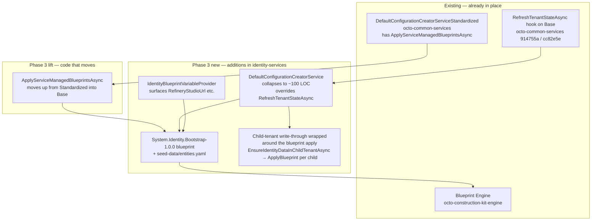

# Phase 3 — Identity tenant seed as a service-managed blueprint

**Status:** ✅ **Shipped 2026-06-15.** All five PRs merged + one upstream engine fix discovered during burn-in.
**Author:** Gerald Lochner + Claude (concept skeleton + cutover execution).
**Scope:** `octo-identity-services` exclusively. The Phase 2 base-class hooks (`RefreshTenantStateAsync`, `ApplyServiceManagedBlueprintsAsync`, blueprint engine's `force: true` re-apply) are the inputs; this concept turns Identity into a consumer of them and removes the workaround code that Phase 2 §4.2 deferred.

## Ship summary

| PR | Repo | Commit | Subject |
|---|---|---|---|
| #25 | octo-common-services | `9e296c6` | Lift `ApplyServiceManagedBlueprintsAsync` from Standardized → Base (§4.1) |
| #87 | octo-identity-services | `4141e31` | Add `System.Identity.Bootstrap-1.0.0` blueprint (§4.2) |
| #88 | octo-identity-services | `5269a9e` | `IdentityBlueprintVariableProvider` + flagged `RefreshTenantStateAsync` override (§4.3) |
| #191 | octo-construction-kit-engine | `8832520` | Fix `BlueprintVariableInterpolator` for list-valued attributes (burn-in finding) |
| #89 | octo-identity-services | `826ed0c` | Cutover `SetupTenantAsync` → blueprint apply; `PreBlueprintCleanupMigration` (§4.4) |
| #90 | octo-identity-services | `7f0d306` | Cleanup: delete feature flag + `IdentitySchemaVersionKey`/`Value` (§5 step 5) |

The §4.4 "DefaultConfigurationCreatorService collapse" landed mostly as designed: 1063 → 368 LOC. Two surprises during burn-in evolved the design, both recorded below.

## 1. Why Phase 3

Phase 2 closed the symptom — a refinery-studio API resource missing a claim after a child-tenant restore from an older backup — with a targeted backfill on `EnsureIdentityResourceAsync` (commit `c3ada84`). The fix works, but the design rationale carries a clear sunset: the moment Identity expresses its seed (roles, OIDC clients, identity resources, API scopes, API resources, groups) as a service-managed blueprint, the backfill collapses into a normal blueprint `force: true` re-apply on the existing `RefreshTenantStateAsync` hook, and Identity stops being the architectural outlier in the OctoMesh service family. That collapse is what Phase 3 implements.

The blueprint pattern is already proven in production by Communication-Controller (`System.Communication.Release-1.5.0`, `…MainLatest-1.4.0`) and Admin-Panel (`System.UI.SystemCockpit-1.0.0` et al). Both ship the seed alongside the CK model and let `DefaultConfigurationCreatorServiceStandardized.ApplyServiceManagedBlueprintsAsync` drive idempotent application on Enable / startup / lifecycle event. The Phase 2 isRuntimeState contract protects volatile state from being trampled on re-apply (CK-engine `BlueprintService.PreserveRuntimeStateAttributesAsync`). Phase 3 brings Identity onto the same path.

### What turned out to be already solid (the grounding result)

Three parallel deep-dives in 2026-06-13:

- **All seeded Identity entities are first-class CK types** in `System.Identity-2.7.0` — `RtRole`, `RtIdentityResource`, `RtApiScope`, `RtApiResource`, `RtClient`, `RtGroup`, plus the disabled `RtGoogleIdentityProvider` / `RtMicrosoftIdentityProvider` stubs. Nothing seeded today escapes the CK runtime; the IdentityServer-internal stores (`ServerSideSessionStore`, `DataProtectionKeyStore`, `PersistentGrantStore`) handle only runtime data and have no seed step.
- **No seeded attribute is `isRuntimeState: true` today.** Identity's seed is pure configuration — there is no runtime state to preserve on re-apply, so the `force: true` path is safe without further CK-model work.
- **The Communication template translates 1:1.** The seed YAML format supports CK associations, blueprint variable substitution (`${octo.*}`), and per-cluster gating via `requires:` blocks. The seed-data agent found no blockers.

### What's genuinely new in this phase

- **Identity is the last service still on `DefaultConfigurationCreatorServiceBase` (not Standardized).** The `ApplyServiceManagedBlueprintsAsync` method from Phase 2 PR #1 sits on Standardized only. Phase 3 either lifts the method up onto Base, or Identity inlines its own minimal copy. The decision affects every other service that might join Standardized later.
- **The refinery-studio client is dynamic.** Its `RedirectUris` / `AllowedCorsOrigins` / `FrontChannelLogoutUri` derive from `OctoIdentityServicesOptions.RefineryStudioUrl`. The current code runs `EnsureRefineryStudioClientAsync` on every startup outside the schema-version gate. A blueprint can carry the client shape, but the URL itself has to come from a blueprint variable (`${octo.identity.refineryStudioUrl}` or similar). The blueprint engine's `IBlueprintVariableProvider` is extensible — Identity registers a provider that surfaces the option value.
- **Client mirror provisioning stays in code.** `IClientMirrorProvisioningService` operates across parent/child tenant boundaries and writes `RtClientMirror` tracking rows; that pattern is orthogonal to "apply a blueprint to one tenant" and is correctly kept as a service.

## 2. The three concrete pain points Phase 3 closes

### P1 — Identity child-tenant drift (root cause, not symptom)

Phase 2 §2 P1: `EnsureXxxAsync` are insert-or-skip. The Phase 2 backfill on `EnsureIdentityResourceAsync` fixes the *claims* drift specifically (one observed regression) but leaves the broader class open — a future `DisplayName` change, a renamed scope, an updated `IsRequired` flag on an identity resource, none of those backfill today. A blueprint with `force: true` on lifecycle events rewrites every seed attribute regardless of class, so the next round of drift never surfaces.

### P2 — Two write-through code paths (system tenant vs child tenant)

Identity today maintains two parallel seed code paths in the same file (`DefaultConfigurationCreatorService.cs`, ~1000 LOC). System-tenant writes use the `IdentityServer` stores (`IOctoClientStore`, `IOctoResourceStore`, `RoleManager<RtRole>`) gated by `IdentitySchemaVersionKey = 17`. Child-tenant writes go through `EnsureXxxInChildTenantAsync` directly against the child's repository. The two paths drifted independently before — that is exactly the kind of subtle inconsistency Phase 2 audit flagged as the highest incident risk. The blueprint engine's per-tenant apply collapses both paths into one method call (`IBlueprintService.ApplyBlueprintAsync(tenantId, blueprintId, force: …)`), with the system tenant and every child tenant treated identically.

### P3 — Schema version coupling

`IdentitySchemaVersionKey` lives in the system tenant only. Bumping it (the next time Identity adds a new role) requires touching the constants file, remembering to re-test the version gate, and accepting that the *child* tenants will be reseeded via `EnsureXxx`'s insert-or-skip semantics — never a clean rewrite. `BlueprintInstallation` rows (per-tenant, written by the engine) already provide a more granular state model: every tenant has its own row, every version bump produces a fresh apply on every tenant. The schema-version row becomes unnecessary.

## 3. Goal

After Phase 3:

1. Every Identity seed entity lives in `octo-identity-services/src/Persistence.IdentityCkModel/Blueprints/System.Identity.Bootstrap/`, shipped as an embedded blueprint via `BlueprintEmbed` MSBuild + `BlueprintSourceGenerator`.
2. `DefaultConfigurationCreatorService.SetupTenantAsync` reduces to: import CK model → run CK-model + infrastructure migrations → `ApplyServiceManagedBlueprintsAsync(tenantId, throwOnFailure: true)`. The 1000-LOC body collapses.
3. `RefreshTenantStateAsync` overrides to `ApplyServiceManagedBlueprintsAsync(tenantId, throwOnFailure: false, force: true)`, replacing both the Phase 2 backfill workaround in `EnsureIdentityResourceAsync` and the broader child-tenant drift class.
4. `IdentitySchemaVersionKey` and `IdentityServiceConstants.IdentitySchemaVersionValue` are deleted. Each tenant's `BlueprintInstallation` row replaces them.
5. Client mirror provisioning stays as a service, runs after the blueprint apply succeeds for the parent tenant.

Non-goals:

- Migrating Identity to `DefaultConfigurationCreatorServiceStandardized`. The blueprint apply method is what we need; the rest of Standardized (deferred-tenant batching, `_serviceEnabledKey`, identity-data Distribution Hub commands) does not fit Identity's bootstrap role. We lift the one method down to Base instead, mirroring Phase 2 §4 §4.1.
- Touching `User` / `ExternalTenantUserMapping` / `ServerSideSession` / `DataProtectionKey` / `PersistedGrant`. Those are runtime data, not seed.
- Replacing `EnsureRefineryStudioClientAsync`'s reactive URL update — the blueprint's `${octo.identity.refineryStudioUrl}` placeholder takes over.
- Splitting into Release / MainLatest variants. Identity's seed is cluster-uniform (modulo the refinery-studio URL, handled via variable substitution). The Communication-style variant split would add ceremony with no per-cluster differentiation to express.

## 4. Design

Six components, four in `octo-identity-services` and two in `octo-common-services`. The split is intentional: the lift down to Base + the blueprint method on Base are reusable platform infrastructure; everything else is Identity-local.



### 4.1 Lift `ApplyServiceManagedBlueprintsAsync` onto Base

Identity is on `DefaultConfigurationCreatorServiceBase`. Phase 2 PR #1 added the method to `DefaultConfigurationCreatorServiceStandardized`. The cleanest fix is to lift the method, the `ServiceManagedBlueprintPrefix` property, the `IsServiceManagedBlueprint` predicate, and the `OnServiceManagedBlueprintApplyFailedAsync` hook from Standardized down to Base. The constructor of Base does not currently take the blueprint dependencies — we add them as optional params at the tail, identical to the Phase 2 PR #1 approach on Standardized:

```csharp
protected DefaultConfigurationCreatorServiceBase(
    ILogger<DefaultConfigurationCreatorServiceBase> logger,
    IBlueprintService? blueprintService = null,
    IEnumerable<IBlueprintEmbeddedSource>? embeddedBlueprintSources = null)
```

Standardized's overload forwards the new params unchanged. Every other service that inherits Standardized is unaffected; the seven services that inherit only Base (today just Identity) gain access by passing the dependencies through. This is purely additive and runs against the same Phase 2 PR #1 tests after the lift (they get duplicated against the Base-level method, which is the point — both inheritance paths have the same contract).

### 4.2 `System.Identity.Bootstrap-1.0.0` blueprint

New directory under `octo-identity-services/src/Persistence.IdentityCkModel/Blueprints/System.Identity.Bootstrap/`. Folder name matches the manifest's `blueprintId.Name`; the `BlueprintEmbed` MSBuild task enforces this.

```
src/Persistence.IdentityCkModel/Blueprints/
└── System.Identity.Bootstrap/
    ├── blueprint.yaml         # blueprintId: System.Identity.Bootstrap-1.0.0
    └── seed-data/
        └── entities.yaml      # the 14 roles, 5 identity resources, 3 scopes, 1 api resource, 3 clients, 1 group
```

Manifest:

```yaml
$schema: https://schemas.meshmakers.cloud/blueprint-meta.schema.json
blueprintId: System.Identity.Bootstrap-1.0.0
description: |
  Service-managed Identity seed — system + child tenants. Provides the
  default role set, the OctoApi resource (with role claim), the OAuth
  client baseline (OctoTool, IdentityServices Swagger, optional Refinery
  Studio SPA), and the TenantOwners group with role assignments. Replaces
  the imperative DefaultConfigurationCreatorService.SetupTenantAsync seed
  block; the schema-version row IdentityService=17 is retired in favour
  of per-tenant BlueprintInstallation rows.

ckModelDependencies:
  - System.Identity-[2.7.0,3.0)
```

No `requires:` block — Identity's seed applies to every tenant on every cluster.

The seed YAML lists every static entity with hand-coded stable `rtId` values (so the same blueprint id rewrites the same entity on re-apply, regardless of tenant). Examples:

```yaml
$schema: https://schemas.meshmakers.cloud/runtime-model.schema.json
dependencies:
  - System.Identity-2.7.0
entities:
  - rtId: '660000000000000000000001'
    ckTypeId: System.Identity/Role
    rtWellKnownName: TenantManagement
    attributes:
      - id: System.Identity/Name
        value: TenantManagement
      - id: System.Identity/NormalizedName
        value: TENANTMANAGEMENT

  # ... 13 more roles ...

  - rtId: '660000000000000000000020'
    ckTypeId: System.Identity/ApiResource
    rtWellKnownName: OctoApi
    attributes:
      - id: System.Identity/Name
        value: octo-api
      - id: System.Identity/Claims
        value:
          - role
      - id: System.Identity/Scopes
        value:
          - octo-api.full-access
          - octo-api.read-only

  - rtId: '660000000000000000000030'
    ckTypeId: System.Identity/Client
    rtWellKnownName: RefineryStudioClient
    attributes:
      - id: System.Identity/ClientId
        value: octo-data-refinery-studio
      - id: System.Identity/RedirectUris
        value:
          - '${octo.identity.refineryStudioUrl}/'
      - id: System.Identity/AllowedCorsOrigins
        value:
          - '${octo.identity.refineryStudioUrl}'
      # ...

  - rtId: '660000000000000000000040'
    ckTypeId: System.Identity/Group
    rtWellKnownName: TenantOwners
    associations:
      - roleId: System.Identity/AssignedRole
        targetRtId: '660000000000000000000001'   # TenantManagement
        targetCkTypeId: System.Identity/Role
      - roleId: System.Identity/AssignedRole
        targetRtId: '660000000000000000000002'   # UserManagement
        targetCkTypeId: System.Identity/Role
      # ... 12 more role associations ...
    attributes:
      - id: System.Identity/Name
        value: TenantOwners
```

Conventions:

- **Stable `rtId`s** chosen from a clean range (e.g. `660000000000000000000000`–`660000000000000000000099`) so re-apply matches existing entities deterministically and the `force: true` path uses `ReplaceOne` instead of `InsertOne`.
- **Association seeding** mirrors Communication-Controller's pattern — explicit `roleId`/`targetRtId`/`targetCkTypeId` triples on the source entity. The TenantOwners group's 14 role assignments are seeded once, eliminating the runtime `SetRoleIdsAsync` reconciliation logic in `CreateDefaultGroupsAsync`.
- **Variable substitution** for the Refinery Studio client's URL fields via `${octo.identity.refineryStudioUrl}`. When the cluster has the option unset, the blueprint `requires:` block can gate the entity — but cleaner: keep the entity always-present with an empty placeholder, since the OIDC flow only fires on user login and an empty redirect URI is a configuration error operators can spot quickly. (Discussion in §8.)

### 4.3 `IdentityBlueprintVariableProvider`

The blueprint engine resolves variables via `IBlueprintVariableProvider` instances registered in DI. The built-in provider supplies `${octo.version}`, `${octo.environment}`, `${octo.systemTenantId}`, `${octo.isSystemTenant}`. Identity adds one more for `${octo.identity.refineryStudioUrl}`:

```csharp
internal class IdentityBlueprintVariableProvider(
    IOptions<OctoIdentityServicesOptions> options) : IBlueprintVariableProvider
{
    public IReadOnlyDictionary<string, string> GetVariables(string tenantId) =>
        new Dictionary<string, string>
        {
            ["octo.identity.refineryStudioUrl"] =
                options.Value.RefineryStudioUrl?.TrimEnd('/') ?? ""
        };
}
```

Registered in `Program.cs` alongside `AddBlueprintSystemIdentityBootstrapV1()`. The trailing-slash policy stays consistent with the existing `EnsureRefineryStudioClientAsync` code (which appends `/`).

### 4.4 `DefaultConfigurationCreatorService` collapse

The new shape is essentially:

```csharp
protected override async Task SetupTenantAsync(string tenantId)
{
    var previousSchemaVersions = await CaptureSchemaVersionsAsync(tenantId);

    if (tenantId == systemContext.TenantId)
    {
        await systemContext.EnsureSystemCkModelAsync();
        if (!await systemContext.IsSystemTenantExistingAsync())
            await systemContext.CreateSystemTenantAsync();
    }

    var tenantContext = tenantId == systemContext.TenantId
        ? systemContext
        : await systemContext.GetChildTenantContextAsync(tenantId);

    await ImportCkModel(tenantContext);
    await RunCkModelMigrationsAsync(tenantContext, previousSchemaVersions);
    await migrationService?.ExecuteMigrationsAsync(...);

    // Blueprint apply — replaces ALL of the old CreateXxx / EnsureXxxAsync chains
    await ApplyServiceManagedBlueprintsAsync(tenantId, throwOnFailure: true);

    // Tenant configuration / mail templates from System.Notification stay in code
    // (separate concern, separate blueprint candidate in a follow-up)
    await CreateTenantConfiguration(tenantContext);

    if (tenantId != systemContext.TenantId && clientMirrorProvisioningService != null)
        await clientMirrorProvisioningService.ProvisionForChildTenantAsync(
            systemContext.TenantId, tenantId);
}

protected override async Task RefreshTenantStateAsync(string tenantId)
{
    // The whole point of Phase 3: the workaround on EnsureIdentityResourceAsync
    // and the broader EnsureXxx insert-or-skip class are both replaced by this one
    // force-apply on the same blueprint that SetupTenantAsync uses.
    await ApplyServiceManagedBlueprintsAsync(tenantId, throwOnFailure: false);
}

protected override string? ServiceManagedBlueprintPrefix => "System.Identity.";
```

The 800 LOC of `EnsureXxxAsync` / `EnsureXxxInChildTenantAsync` / `CreateXxx` methods get deleted alongside the constants `IdentitySchemaVersionKey` / `IdentitySchemaVersionValue` and the entire schema-version transaction.

### 4.5 What stays unchanged

- Notification CK model imports + mail template seeding (`CreateTenantConfiguration`). These live in `System.Notification`, not `System.Identity`, and are a candidate for a separate `System.Notification.Bootstrap` blueprint in a future iteration — out of scope here.
- `IClientMirrorProvisioningService`. Runs after blueprint apply succeeds; its tracking row writes to the parent tenant, not the target. Phase 3 only ensures the parent's `RtClient` entities exist before the mirror service tries to copy them — which is already the case after `ApplyServiceManagedBlueprintsAsync` succeeds on the parent.
- `EnsureRefineryStudioClientAsync`. **Deleted** by Phase 3. The blueprint owns the client; the variable provider owns the dynamic URL.
- `DefaultConfigurationCreatorService`'s inheritance from `Base` (not `Standardized`). Phase 3 lifts the method down, not Identity up.
- Identity providers (Google, Microsoft seed stubs). Already disabled by default; included in the blueprint as static entities. Operators flip `IsEnabled=true` via the admin API after configuring credentials.

## 5. Migration plan

Five PRs across two repos. Each independently revertable. Identity is the highest blast-radius backend; we sequence accordingly.

| Step | Repo | What | Risk | Shipped |
|---|---|---|---|---|
| 1 | octo-common-services | Lift `ApplyServiceManagedBlueprintsAsync` + the property + predicate + failure hook + ctor params from Standardized down to Base. Standardized inherits unchanged. | low — additive on Base; behavioral equivalence on Standardized (same code, different location) | ✅ PR #25 `9e296c6` |
| 2 | octo-identity-services | Add the `System.Identity.Bootstrap-1.0.0` blueprint folder under Persistence.IdentityCkModel. Wire the `BlueprintFolder` MSBuild item. Register `AddBlueprintSystemIdentityBootstrapV1()` in `Program.cs`. Do NOT call `ApplyServiceManagedBlueprintsAsync` yet — the blueprint exists in DI but is dead code. | low — opt-in by next step | ✅ PR #87 `4141e31` |
| 3 | octo-identity-services | Add `IdentityBlueprintVariableProvider`. Behind a feature flag (`OctoIdentityServicesOptions.UseBlueprintBootstrap=false` default), wire the override: `ServiceManagedBlueprintPrefix => "System.Identity."`, `RefreshTenantStateAsync` override calls `ApplyServiceManagedBlueprintsAsync(tenantId, throwOnFailure: false)`. Flag stays `false` so the seed path in `SetupTenantAsync` is unchanged. Test on test-2 by flipping the flag on a side cluster and observing `BlueprintInstallation` rows appear without disturbing the existing seed. | **medium** — Identity is high-blast-radius; the flag-on-test-2 burn-in is the validation phase | ✅ PR #88 `5269a9e` |
| 4 | octo-identity-services | Switch `SetupTenantAsync` to call `ApplyServiceManagedBlueprintsAsync` instead of the inline `CreateXxx` / `EnsureXxxAsync` chains. Delete the methods. Keep the flag for one release as a rollback latch. | **medium-high** — the actual cutover. test-2 burn-in is the gate. Roll forward on staging-1 only after a week of clean test-2 logs. | ✅ PR #89 `826ed0c` |
| 5 | octo-identity-services + octo-common-services | Delete the feature flag, delete `IdentitySchemaVersionKey` / `IdentitySchemaVersionValue` constants, delete the schema-version gate transaction, retire the Phase-2 backfill in `EnsureIdentityResourceAsync` since it has no caller. Update concept doc §6 to mark the follow-up "shipped". | low — pure cleanup, after prod has run on Phase 3 for one release cycle | ✅ PR #90 `7f0d306` |

The flag in step 3 (`UseBlueprintBootstrap`) gates **only the override of `RefreshTenantStateAsync`**, not the static seed path. That lets us observe blueprint installations writing without competing with the existing seed transaction. Step 4 flips the static path. Steps 3 and 4 are intentionally separate so a problem at step 4 has a one-line rollback (step 3 stays); a problem with the blueprint shape surfaces at step 3 without touching seed semantics.

### 5a. Surprises during burn-in — design changes that landed

These were not in the original concept; both surfaced on the local burn-in against octosystem / meshtest / ai-sandbox and were folded into PR #89 before merge.

1. **`BlueprintVariableInterpolator` did not substitute inside list-valued attributes** — the engine's interpolator only touched `attribute.Value is string`, so `RedirectUris: ['${octo.identity.refineryStudioUrl}/']` and `AllowedCorsOrigins: ['${octo.identity.refineryStudioUrl}']` landed in MongoDB as literal placeholder strings. Duende's redirect-URI validation then rejected every Refinery Studio login. Fixed upstream in `octo-construction-kit-engine` PR #191 (`8832520`); cascade re-publishes the engine NuGet, Identity picks it up on its next image build.
2. **Identity service was the only Standardized consumer that did NOT register `AddMongoBlueprintSupport()`.** Without it, the engine defaults to `InMemoryTenantBlueprintInstallations` and `BlueprintInstallation` rows never land in MongoDB even though the log claims "1 blueprints installed". Fixed in `octo-identity-services` PR #89 by adding the registration inside `AddOctoIdentityPersistence`, so every consumer of the persistence builder (including the integration-test fixtures) picks it up automatically.
3. **`PreBlueprintCleanupMigration` evolved into a two-phase verbatim-preservation migration.** The original "delete OLD entities + orphan associations" design lost every user's role assignments because:
   - `User → Role` edges live as `AssignedRole` associations, but
   - `ExternalTenantUserMapping → Role` is stored in the `MappedRoleIds` attribute (the schema disallows `AssignedRole` on this type).
   The migration now (a) reads the OLD role names from both origin types into a `PendingPostBlueprintRoleAssignments` TenantConfiguration row, (b) deletes OLD entities + orphan associations in the right order so the engine's target-existence validator passes, and (c) post-blueprint, `DefaultConfigurationCreatorService.SetupTenantAsync` reads the pending row and re-attaches by name → new stable rtId. Crash-safe across restarts because the pending row persists in MongoDB. Validated locally on octosystem (3 `User → Role` remappings) + meshtest (2 `ExternalTenantUserMapping.MappedRoleIds` entries) with the exact rtIds matching the blueprint's `660…01..0E` range.

## 6. Follow-ups out of scope for Phase 3

- **`System.Notification.Bootstrap-1.0.0`** for the mail templates + `RtMailNotificationConfiguration` Identity currently seeds inline. Same pattern as `System.Identity.Bootstrap`; smaller footprint, lower risk, but the Identity refactor is enough for one phase. **Status: still open** — natural next item now that the Phase 3 pattern is fully exercised; the lift is mechanical (Mail-Templates out of `DefaultConfigurationCreatorService.CreateTenantConfiguration` into a `System.Notification.Bootstrap` blueprint).
- **Identity provider configuration** (Google client id / secret, Azure AD tenant id, OpenLDAP host). Today these are operator-configured via REST. A future `System.Identity.Providers` blueprint could parameterize them via cluster env vars — but only if there's a real operator pain point. None has surfaced. **Status: deferred indefinitely** (no pain signal).
- **Refinery Studio dashboard for the Phase 2 Step 6 observability API.** UI work in `octo-frontend-refinery-studio`. Tracked separately; Phase 3 doesn't block it. **Status: still open** — Phase 2 backend (`/system/v1/services/{key}/drift` + 4 sister endpoints) is live in `octo-platform-services`; UI scope likely cross-tenant-only (system-tenant operator surface, not a per-tenant Meshboard).
- **MACO drift surfacing.** Phase 2 §6 follow-up. Independent of Identity. **Status: still open** — folded into the drift-dashboard scope above; MACO's non-standard scopes (`SystemApi` / `TenantApi`) need to round-trip the observability API correctly.

## 7. Risks

- **Identity is the highest blast-radius service.** Step 4's cutover is the gate. Mitigation: the flag in step 3 + a side-cluster burn-in. If the blueprint version bumps incorrectly mid-rollout, every tenant gets the new seed on next startup; that is the *intent* but it must be deliberate. Concrete mitigation: pin the blueprint at `1.0.0` for the entire Phase 3 rollout; only bump after the workaround code in `EnsureIdentityResourceAsync` is deleted (step 5) so the bump is the first real test of the round-trip.
- **The `${octo.identity.refineryStudioUrl}` placeholder allows accidental empty values.** If `OctoIdentityServicesOptions.RefineryStudioUrl` is unset, the blueprint seeds an `RtClient` with an empty redirect URI. The OIDC challenge fails fast — visible to the operator on first login attempt — but the blueprint still wrote the entity. A `requires:` gate (`requires.octo.identity.refineryStudioUrl: ".+"`) keyed off the variable would skip the entity instead of seeding a broken one; **decision in §8**.
- **Schema-version row deletion is a one-way door.** Once step 5 deletes `IdentitySchemaVersionKey`, downgrading to a pre-Phase-3 image loses the seed-version state — but the old code's gate would still trigger a no-op insert because the entities exist. Net effect: no functional regression on downgrade, just one stray `RtConfiguration` row missing. The risk is operational confusion, not data loss.
- **The lift in step 1 affects 7 other services.** Standardized inherits Base; the ctor change adds optional params that flow through. Every Standardized subclass already passes positional args by position — the new optional params at the tail are backward-compatible (Phase 2 PR #1 had the same shape). But it's worth running every consumer service's unit suite after step 1 (Comm-Ctrl 373/373, Admin-Panel build, Asset-Repo, Bot, Report, MCP, AI) to confirm.

## 8. Open decisions — resolved

1. **`${octo.identity.refineryStudioUrl}` placeholder gate** → **decided: blueprint stays unconditional, empty placeholder accepted.** The seed entity for the Refinery Studio client is always written; if the operator left `OctoIdentityServicesOptions.RefineryStudioUrl` unset, the redirect URI is empty and OIDC fails fast on the first login attempt — visible to the operator on the spot, no silent breakage. The `requires:` workaround was rejected because (a) gating one entity vs. the whole blueprint is not in the engine contract and (b) every cluster that ships Identity ships Refinery Studio too.
2. **Stable `rtId` range** → **decided: `660…` for System.Identity, `680…` reserved for System.Notification, `670…` already in use by System.Communication.** All 37 seed entities are hand-written in the `660…01..40` range.
3. **Inline `CreateTenantConfiguration` (Notification templates)** → **decided: leave for Phase 3.** Lifted out as Phase 3.5 (`System.Notification.Bootstrap-1.0.0`, see §6).
4. **Constant-name policy** → **decided: hard-delete in step 5.** No `[Obsolete]` period — Phase 3 ships as one coordinated rollout and the constants have no callers post-step-4.

---

Concept shipped 2026-06-15. The next natural items are `System.Notification.Bootstrap-1.0.0` (mechanical lift of the inline mail-template seed, ~50 LOC out of `CreateTenantConfiguration`) and the drift-dashboard UI on top of the live Phase 2 observability API.
